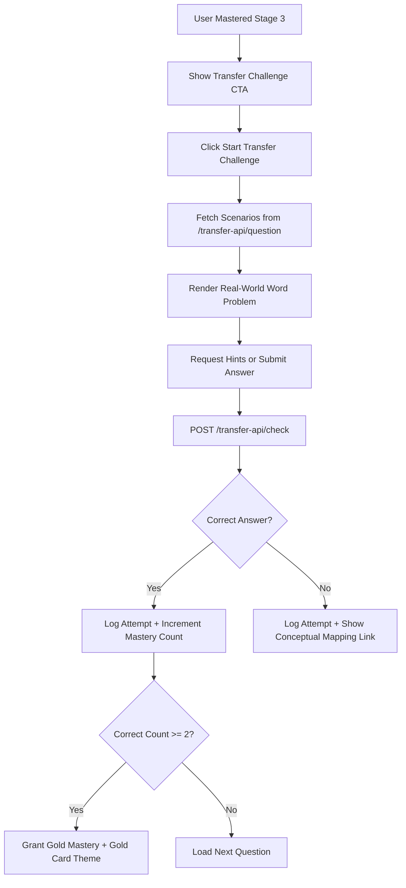

# Feature Walkthrough: Learning Transfer Challenges (Version 2)

This document provides a comprehensive walkthrough of the implementation, file changes, and testing procedures for the **Learning Transfer Challenges (Stage 4)** feature in Tenali. **Version 2** expands this feature dynamically to all learning modules in the platform using a generic dynamic generator fallback.

---

## 1. Feature Overview

The **Learning Transfer Challenges** feature provides a diagnostic layer that tests a student's conceptual understanding by asking them to apply mathematical procedures they have mastered in Stage 3 drills (percentages, ratios, fractions) to real-world, contextually diverse word problems (shopping, cricket, cooking, travel, etc.).

Successful completion of at least 2 transfer challenges triggers a **Gold Mastery Badge 🥇** and unlocks a premium **Gold Card Theme** on the dashboard.

---

## 2. Architecture & Implementation Details

The implementation is split across the Express backend and React frontend.



### Backend Implementation

1. **Scenario Generator (`server/transferScenarios.js`)**: 
   - Houses a modular set of real-world scenario builders grouped by topic key (`percent`, `ratio`, `fraction`).
   - Every scenario implements:
     - `generate()`: Produces randomized input variables, templates the contextual prompt, and defines up to three hints (Hint 1: Free conceptual guidance; Hint 2: Specific formula; Hint 3: Solved numerical example).
     - `evaluate(variables)`: Determines the correct answer.
     - `explanation(variables)`: Step-by-step math evaluation.
     - `transferMapping`: Explains the link between the abstract math concept and the real-world usage.
2. **API Routes (`server/index.js`)**:
   - `GET /transfer-api/question`: Picks a random transfer scenario for a specified topic, executes its variable generator, and serves it to the frontend.
   - `POST /transfer-api/check`: Evaluates the user's input, logs the attempt to the database (saving details such as seconds elapsed, hints clicked, and question prompt), increments the guest/authenticated user's correct counters, and returns the step-by-step solution.
3. **Database Logger (`server/auth.js`)**:
   - Integrates the Mongoose `StudentAttemptLog` schema to record detailed telemetry data (`studentId`, `topicKey`, `challengeType: 'transfer'`, `transferScenarioId`, `transferContext`, `hintsClickedCount`, `timeSpentSeconds`).

### Frontend Implementation

1. **Transfer Challenge View (`client/src/App.jsx`)**:
   - Implemented `TransferChallengeApp` to handle the interactive workflow.
   - Shows introductory screens explaining the rules and badge details (coin references removed).
   - Renders context tags (e.g., Cooking 🍕, Shopping 🛒) and progressive hint tabs.
   - Includes a unified text input field allowing user submissions and supports automated enter-key transitions.
   - Displays a celebratory screen with animated gold badges upon achieving Gold Mastery (with no coin mentions).
2. **Game Welcome Box Integration (`client/src/App.jsx`)**:
   - Added conditional Transfer CTAs within the home configurations of:
     - `PercentApp` (Percentages)
     - `RatioApp` (Ratio & Proportion)
     - `FractionAddApp` (Fraction Addition)
   - These check the user's `completedTopics` array and show the Stage 4 transfer button if the topic key is present.
3. **Vite API Proxies (`client/vite.config.js`)**:
   - Configured Vite proxy settings to pipe `/transfer-api/*` calls from the React app directly to the Express server running on port 4000.

---

## 3. Files Changed / Added

| Operation | File Path | Description |
| :--- | :--- | :--- |
| **[NEW]** | [server/transferScenarios.js](file:///c:/Users/varsh/My%20Projects/tenali/server/transferScenarios.js) | Core scenario definitions, templates, evaluation formulas, and hints. |
| **[MODIFY]** | [server/index.js](file:///c:/Users/varsh/My%20Projects/tenali/server/index.js) | Added `GET /transfer-api/question` and `POST /transfer-api/check` API routes. |
| **[MODIFY]** | [server/auth.js](file:///c:/Users/varsh/My%20Projects/tenali/server/auth.js) | Defined the Mongoose schema for persistent student attempt tracking. |
| **[MODIFY]** | [client/src/App.jsx](file:///c:/Users/varsh/My%20Projects/tenali/client/src/App.jsx) | Created the `TransferChallengeApp` component and integrated CTA buttons inside game screens. |
| **[MODIFY]** | [client/src/App.css](file:///c:/Users/varsh/My%20Projects/tenali/client/src/App.css) | Added design systems and CSS styling for the new transfer interface. |
| **[MODIFY]** | [client/vite.config.js](file:///c:/Users/varsh/My%20Projects/tenali/client/vite.config.js) | Configured local proxies to route `/transfer-api` traffic to the backend. |

---

## 4. How to Test the Feature

### Setup Local Servers
1. Start the backend Express server:
   ```powershell
   cd server
   npm install
   npm start
   ```
   *(Confirm output prints: `Tenali app running on http://0.0.0.0:4000`)*

2. Start the client Vite development server in a separate terminal:
   ```powershell
   cd client
   npm install
   npm run dev
   ```
   *(Open browser to: `http://localhost:5173/`)*

---

### Step-by-Step Testing Guide

#### Scenario A: Triggering Transfer Challenge (Natural Progression)
1. Select the **Percentages** game from the grid.
2. Complete a standard Stage 3 practice quiz (e.g. 5 or 10 questions) achieving a score of **80% or higher**.
3. Upon completion, return to the welcome page of Percentages.
4. You will see a newly unlocked **🚀 Start Transfer Challenge (Stage 4) 🥇** CTA block at the bottom of the welcome box.

#### Scenario B: Triggering Transfer Challenge (Developer Debug / Fast-Track)
1. Go to the dashboard home page.
2. Scroll to the very bottom and click the **🔄 Reset All Progress** button.
3. Click the **⚙️ Toggle Stage 3 Mastery** button. 
4. Type **`percent`** in the prompt box and click OK. The page reloads, and the Percentages game card displays a green checkmark (**✅**).
5. Click **⚙️ Toggle Stage 3 Mastery** again, type **`ratio`**, and click OK.
6. Click **⚙️ Toggle Stage 3 Mastery** again, type **`fractionadd`**, and click OK.
7. Open the **Percentages**, **Ratio & Proportion**, or **Fractions** game card. The **🚀 Start Transfer Challenge (Stage 4) 🥇** button will be visible instantly.

#### Scenario C: Verifying the Transfer Challenge Interface & Hint Mechanics
1. On the game welcome screen, click **🚀 Start Transfer Challenge (Stage 4) 🥇**.
2. Click **Start Challenge 🥇** inside the intro dialog.
3. Verify that the layout loads:
   - Displays a contextual icon and tag (e.g., Pizza 🍕, Travel 🚂) corresponding to the scenario.
   - Shows the word-problem prompt clearly.
   - Renders a **💡 Hint Level 1** button.
4. Click the **💡 Hint Level 1** button. Verify that a card pops up with conceptual instruction.
5. Observe the Hint button label shifts to **💡 Hint Level 2**. Click it to confirm it displays the corresponding math formula without any point/coin cost.

#### Scenario D: Verifying Solution Explanations & Mastery Completion
1. Enter an incorrect answer (or just type `1` or `xyz`) and hit **Submit Answer** or press `Enter`.
2. Verify that:
   - Feedback panel is highlighted in **red**.
   - Displays `❌ Let's review this:` followed by the correct numerical answer.
   - Shows the step-by-step solution path.
   - Shows a **Conceptual Link** explaining the real-world connection.
3. Click **Next Challenge**.
4. Solve the next question correctly. Once submitted, verify the success banner highlights in **green** with `✅ Well done!`.
5. Click **Next Challenge** (or **Complete Challenge**).
6. Complete the challenges. If you answered at least 2 questions correctly (this may require starting a second attempt if you missed the first), confirm that:
   - The **Gold Mastery Achieved! 🥇** banner is shown.
   - The **Results Table** summarizes your prompt, userAnswer, correctAnswer, correctness status, and seconds spent.
7. Click **Back to Dashboard** and verify the game card now displays a **🥇** badge and is styled with a premium Gold gradient theme.

---

### 3. Version 2: Dynamic Fallback Walkthrough & Testing

Version 2 automatically extends Stage 4 Transfer Challenges to **every single quiz module** on the dashboard. If no dedicated scenario templates are written for a topic, the server generates one on the fly.

#### Verification of Version 2:
1. Complete a Stage 3 Practice for a non-curated topic (e.g., **Addition** or **Trigonometry**).
   - Alternatively, scroll to the bottom of the home dashboard and use **⚙️ Toggle Stage 3 Mastery** to type `addition` (for the Addition game).
2. The dashboard card for **Addition** will display a checkmark (**✅**).
3. Open the card to view the welcome box. The **🚀 Start Transfer Challenge (Stage 4) 🥇** button will be visible!
4. Click the button to start. 
5. Verify that:
   - The challenge loads a dynamic, real-world context prompt (e.g., "Arjun is shopping...", "Priya is adjusting spice levels...").
   - The embedded math question in the story is a randomized addition problem generated by the backend's standard addition quiz generator.
6. Verify checking mechanics:
   - Inputting a correct answer correctly routes the request to `/addition-api/check` internally, returning correct feedback.
   - Inputting an incorrect answer validates correctly and shows the correct answer display along with the solution explanation.
7. Completing 2 challenges successfully awards the Gold Mastery badge (**🥇**) and updates the topic card on the dashboard to the premium Gold card styling, both of which persist across reloads!

---

### 4. Bug Fixes & Refinements (July 2026)

#### TDZ Initialization Crash Fix
- **Issue**: Generated quiz screens crashed with a `ReferenceError: Cannot access 'finished' before initialization` due to the React hook being executed in the Temporal Dead Zone (TDZ) before the variables were declared.
- **Fix**: Relocated the progress-checking `useEffect` down below the state hook declarations in the component body of `GeneratedQuizApp`.

#### Missing API Proxies
- **Issue**: 18 of the learning module API paths (such as `/decimals-api`, `/gst-api`, `/limits-api`) were missing from the Vite dev server proxy list, resulting in `Unexpected token '<'` parsing crashes when requesting questions.
- **Fix**: Registered all 18 missing paths in the `proxy` settings inside `client/vite.config.js`.

#### Incorrect Answer Grading Bug
- **Issue**: For generic fallback transfer challenges, correct expected answers were overridden by the user's input, causing all wrong answers to be evaluated as correct.
- **Fix**: Implemented `buildSubCheckBody` to correctly separate standard/custom topic check parameters and avoid overriding `answer` unless required by custom modules (e.g., `addition`).

#### Dynamic Step-by-Step Explanations
- **Issue**: Generic fallback challenges lacked structured conceptual math explanations.
- **Fix**: Implemented `generateGenericExplanation` to produce dynamic, structured step-by-step mathematical explanations (e.g., Step 1, Step 2) for all fallback topics.
- **UI Refinement**: The incorrect feedback banner header displays a clean `❌ Let's review this:` without the correct answer directly appended to it, which is instead cleanly presented inside the step-by-step description card below it.

---

## 5. Curated Scenario Templates Catalog

Below is the complete catalog of all curated, hand-crafted parametric scenario templates implemented in the database:

| Topic Key | Module Name | Context / Icon | Mathematical Operation / Formula | Prompt Scenario Summary |
| :--- | :--- | :--- | :--- | :--- |
| `percent` | Percentages | Shopping 🛒 / Sports 🏏 / Cooking 🍕 | Compound Percentage, Percentage Increase | Bill discounts + GST, cricket run-rate percent projections, recipe sugar scaling. |
| `ratio` | Ratio | Travel 🚂 / Cooking 🍕 / Shopping 🛒 | Map scale ratio, proportional mixing, share splits | Map distance calculations, lemon juice to water ratio, pocket money divides. |
| `fractionadd` | Fractions | Pocket Money 🛒 / Cooking 🍕 | Fractions sum, fraction subtract from whole | Spent pocket money remaining fraction, pizza slices eaten in total. |
| `addition` | Addition | Travel 🚂 / Shopping 🛒 | Addition and subtraction sequence ($A - B + C$) | Boarding/alighting train passengers, cash refunds after shopping. |
| `decimals` | Decimals | Sports 🏏 / Cooking 🍕 | Decimal sums and remainders ($A + B, A - (B + C)$) | Runner trailing gap times, mixing flours for baking target weights. |
| `hcflcm` | HCF & LCM | Pocket Money 🛒 / Sports 🏏 | HCF ($\text{gcd}$), LCM ($\text{lcm}$) | Packing candies into identical gift bags, circular track runner lap meets. |
| `lineareq` | Linear Equations | Shopping 🛒 / Travel 🚂 | Solving for $x$ in $F + C \cdot x = T$ | Notebook orders with shipping fee, taxi journey distances with base fare. |
| `sdt` | Speed & Time | Travel 🚂 | Lead distance capture, Harmonic Mean speed | Express train catch-up chase times, round trip average speeds. |
| `prob` | Probability | Sports 🏏 / Pocket Money 🛒 | Fractions probability ($\frac{\text{favorable}}{\text{total}}$) | Match win/draw/loss rates, drawing red marbles from mixed jars. |
| `mensur` | Mensuration | Cooking 🍕 / Travel 🚂 | Surface area of open prism, Cylinder volume | Baking tin foil wrap lining, circular water tanker capacity. |
| `quadratic` | Quadratics | Cooking 🍕 / Sports 🏏 | Solving $x(x+D)=C$, projectile flight roots | Cookie grid row layout, ball flight landing duration. |
| `matrix` | Matrices | Shopping 🛒 / Sports 🏏 | Row/Column dot product, Matrix addition | Cinema ticket sales revenue, combining shop branches stock inventory. |
| `angles` | Angles | Travel 🚂 | Supplementary angles ($180 - x$) | Adjacent angles formed by intersecting railway tracks. |
| `basicarith` | Arithmetic | Shopping 🛒 | Total bills ($A \cdot B + C \cdot D$) | Buying notebooks and binders. |
| `banking` | Banking (RD) | Pocket Money 🪙 | RD maturity simple interest summation series | Total maturity value of recurring deposits. |
| `bearings` | Bearings | Travel 🚂 | Opposite bearings ($x \pm 180$) | Return directions for ships sailing on specific bearings. |
| `binomial` | Binomials | Sports 🏏 | Combination count ($\text{C}(n, k)$) | Counts of boundary hitting combinations across cricket overs. |
| `bounds` | Bounds | Cooking 🍕 | Rounding upper/lower bound ranges ($x \pm 0.5$) | Lower bounds of cake flour weights. |
| `circmeasure` | Circle Measure | Travel 🚂 | Radian arc length ($s = r \cdot \theta$) | Curved railroad tracks subtended by radian angles. |
| `circleth` | Circle Theorems | Travel 🚂 | Thales right angles (constant $90^\circ$) | Support beam angles on semi-circular arch bridge designs. |
| `complex` | Complex Numbers| Sports 🏏 | Series impedance additions ($a + bi$) | Complex AC circuit component sums. |
| `congruence` | Congruence | Cooking 🍕 | Triangle congruence tags (e.g. SSS) | Identifying pastry template shape criteria. |
| `conics` | Conics | Travel 🚂 | Parabola focal distances ($y = \frac{x^2}{4f}$) | Communication dish receiver height alignments. |
| `coordgeom` | Coord. Geometry| Travel 🚂 | Coordinate midpoint formulas | Highway relief valve coordinate placement. |
| `diff` | Differentiation | Shopping 🛒 | Function derivation ($dR/dx$) | Determining marginal revenues of sales. |
| `diffeq` | Differential Eq. | Sports 🏏 | Differential equation orders | Finding highest derivative indices of cooling rates. |
| `funceval` | Functions | Shopping 🛒 | Multi-variable function evaluations | Evaluating factory production costs. |
| `gst` | GST | Shopping 🛒 | Tax value products ($P \cdot R\%$) | Retail tax invoicing calculations. |
| `indices` | Indices | Cooking 🍕 | Exponential doubling factor ($2^t$) | Yogurt culture bacterial duplication models. |
| `multiply` | Multiplication | Travel 🚂 | Row-by-column grid products | Express train coach seating capacity calculations. |
| `primefactor` | Prime Factors | Cooking 🍕 | Division into prime numbers sequence | Splitting rectangular cakes into prime-number size squares. |
| `profitloss` | Profit & Loss | Shopping 🛒 | Absolute profit relative to cost price | Handbag merchant sales profit percentages. |
| `pythag` | Pythagoras | Travel 🚂 | Direct hypotenuse routes ($\sqrt{a^2+b^2}$) | Direct distances of hikers traveling East and North. |
| `remfactor` | Remainder Th. | Sports 🏏 | Polynomial evaluation at roots ($P(k)$) | Tournament team groupings remainders. |
| `rounding` | Rounding | Shopping 🛒 | Decimal rounds to whole integers | Estimated shopping cart ticket values. |
| `section` | Section Formula | Travel 🚂 | Midpoints on segments | Highway highway patrol division nodes. |
| `sequences` | Sequences | Pocket Money 🪙 | Arithmetic progression terms ($a + (n-1)d$) | Saving ladder accumulation curves. |
| `shares` | Shares | Shopping 🛒 | Dividends computed on nominal values | Corporate dividend yields payouts. |
| `sets` | Sets | Sports 🏏 | Set intersections ($A + B - \text{both}$) | Overlapping lists of school sports participants. |
| `similarity` | Similarity | Shopping 🛒 | Cubed volumetric scaling factors ($ratio^3$) | Storage box scale prototype to production volumes. |
| `squaring` | Squaring | Cooking 🍕 | Multiplication products ($x^2$) | Square pizza box base areas. |
| `simul` | Sim. Equations | Shopping 🛒 | 2-equation systems | Single adult/child ticket pricing solvers. |
| `stdform` | Standard Form | Travel 🚂 | Exponent divisions ($a \cdot 10^b$) | Space travel durations to distant stars. |
| `stats` | Statistics | Sports 🏏 | Mean batting scores ($\frac{\Sigma x}{n}$) | Running batting scores average means. |
| `surds` | Surds | Travel 🚂 | Root additions ($a\sqrt{b}$) | simplified diagonal walking park pathway lengths. |
| `transform` | Transform | Shopping 🛒 | Translation shift vectors ($x + dx, y + dy$) | Logo vertex coordinate shifts in graphic layouts. |
| `triangles` | Triangles | Cooking 🍕 | Sum of triangle angles ($180 - x - y$) | Napoleon napkin edge angles. |
| `trig` | Trigonometry | Travel 🚂 | Inverse tangent ratios ($\arctan(Opp/Adj)$) | Lighthouse elevation angle sights. |
| `variation` | Variation | Sports 🏏 | Direct variance calculations ($k \cdot x$) | Spring gym bands extension parameters. |
| `vectors` | Vectors | Travel 🚂 | Coordinate additions ($x_1+x_2, y_1+y_2$) | Cumulative walking coordinates of trail hikers. |
| `vocab` | Vocabulary | Travel 🚂 | Geometric terminology tags (e.g. Centroid) | Architectural descriptions vocabulary. |
| `guess` | Guess Number | Pocket Money 🪙 | Binary search counts ($2^n \ge 100$) | Optimal guess limits in guessing games. |
| `gym*` | Gym puzzles | Dynamic | Redirection to parent topics | Gym modules borrow parent topics scenario structures. |

